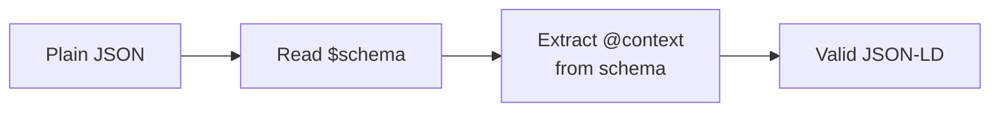

# Guide

## Understanding ISCC Schemas

Digital content identification requires structured metadata: data that describes what a piece of
content is, who created it, and how it may be used. Without a shared vocabulary, every platform
invents its own metadata format, and interoperability breaks down.

ISCC schemas solve this by defining a single, machine-readable vocabulary for digital content
metadata. They are part of the broader [ISCC](https://iscc.codes) ecosystem, which provides
content-derived identifiers standardized as [ISO 24138:2024](https://www.iso.org/standard/77899.html).

The `iscc-schema` package is the canonical source for these definitions. From YAML-based OpenAPI
3.1.0 source files, the build pipeline generates:

- **JSON Schema** for validating metadata objects
- **JSON-LD Context** for semantic mappings to established vocabularies (schema.org, Dublin Core)
- **Python Models** (Pydantic) for creating and validating metadata in Python

## JSON Schema and JSON-LD

ISCC metadata uses two complementary standards that serve different needs:

**JSON Schema** is the primary interface for most developers. It defines field types, constraints,
and defaults for validation — but it also carries human-readable field descriptions, examples, and
documentation inline. This makes it self-documenting: a developer (or an AI agent) can read the
schema and understand every field without consulting external resources.

**JSON-LD Context** maps compact field names like `name` or `creator` to global semantic URIs
(e.g., `http://schema.org/name`), enabling ISCC metadata to participate in the Linked Data web.
This is valuable for semantic interoperability across systems, though it requires dereferencing
URIs to access human-readable descriptions.

Both are generated from the same YAML source definitions, so they are always in sync. Since v0.5.0,
JSON Schema files embed the JSON-LD context directly - one file provides validation rules, inline
documentation, and semantic mappings.

For most use cases, plain JSON with a `$schema` reference is all you need. The schema handles
validation and documentation. When semantic interoperability matters, the embedded JSON-LD context
is always available - either carried in the data directly, or recovered from the schema on demand
(see [Schema-Driven Context Recovery](#schema-driven-context-recovery) below).

## Schema-Driven Context Recovery

iscc-schema v0.5.0 introduced **schema-driven context recovery**: reconstructing full JSON-LD
from compact, plain JSON data.

### The Problem

Plain JSON is compact and easy to work with, but it lacks semantic context. A field called `name`
could mean anything. JSON-LD solves this by adding an `@context` that maps fields to global
identifiers, but carrying the full context in every data object adds verbosity.

### The Insight

The `$schema` field already points to the JSON Schema that describes the data. If the schema
embeds the `@context`, any consumer can recover the full JSON-LD context from the schema alone.

### How It Works



1. Read the `$schema` URL from the data (or infer it from `@type`)
2. Look up the embedded `@context` for that schema
3. Inject the context into the data, which is now valid JSON-LD

### Python Example

```python
from iscc_schema import recover_context

# Plain JSON data without @context
data = {
    "$schema": "http://purl.org/iscc/schema",
    "iscc": "ISCC:KACYPXW445FTYNJ3CYSXHAFJMA2HUWULUNRFE3BLHRSCXYH2M5AEGQY",
    "name": "The Never Ending Story",
}

# Recover the JSON-LD context from the schema reference
result = recover_context(data)

# Result now includes @context with semantic mappings
assert "@context" in result
assert result["name"] == "The Never Ending Story"
```

The function also works with `@type` when `$schema` is absent:

```python
from iscc_schema import recover_context

data = {"@type": "ISBN", "isbn": "9789295055124"}
result = recover_context(data)
# @context is resolved from the ISBN schema
```

### Language-Agnostic Approach

Outside Python, the recovery process is simple:

1. Fetch the JSON Schema from the `$schema` URL
2. Read the `@context` property from the schema's `properties` section
3. Merge the context value into the data object

```
schema = HTTP_GET(data["$schema"])
context = schema["properties"]["@context"]["default"]
data["@context"] = context
// data is now valid JSON-LD
```

### Benefits

Data stays lean because there is no need to embed the full context in every object. Any consumer
can still reconstruct JSON-LD on demand. The schema does triple duty: validation, semantics,
and documentation in one file.

## Schema Categories

### ISCC Metadata

`IsccMeta` is the core metadata model. All fields are optional, so it works for anything from
minimal identification (just an `iscc` field) to full content descriptions with rights, technical
properties, and cryptographic declarations.

```python
from iscc_schema import IsccMeta

meta = IsccMeta(
    iscc="ISCC:KACYPXW445FTYNJ3CYSXHAFJMA2HUWULUNRFE3BLHRSCXYH2M5AEGQY",
    name="The Never Ending Story",
    description="a 1984 fantasy film co-written and directed by Wolfgang Petersen",
)
```

See the [ISCC Metadata schema reference](schema/iscc.md) for all available fields.

### Seed Metadata

Seed metadata provides industry-specific input for Meta-Code generation
([IEP-0002](https://github.com/iscc/iscc-ieps/blob/main/ieps/iep-0002.md)). Unlike ISCC
Metadata, seed schemas have strict required fields to ensure interoperable content fingerprinting
across platforms.

- `ISBN`: book metadata (ISBN, title, publisher, language, etc.)
- `ISRC`: sound recording metadata (ISRC, artist, track title, duration, etc.)

```python
from iscc_schema import ISBN

seed = ISBN(
    isbn="9789295055124",
    title="The Never Ending Story",
    language="eng",
    publisher="Penguin Random House",
)
```

See the [ISBN](schema/isbn.md) and [ISRC](schema/isrc.md) schema references.

### Service Metadata

Service metadata covers use-case-specific schemas served by ISCC registries and discoverable
through ISCC gateways.

- `TDM`: machine-readable text and data mining reservation signals
- `GenAI`: generative AI disclosure signals for content transparency

Service metadata can be used standalone or embedded as nested objects in `IsccMeta`:

```python
from iscc_schema import IsccMeta

meta = IsccMeta(
    iscc="ISCC:KACYPXW445FTYNJ3CYSXHAFJMA2HUWULUNRFE3BLHRSCXYH2M5AEGQY",
    name="The Never Ending Story",
    tdm={"train": "reserved", "inference": "open"},
)
```

See the [TDM](schema/tdm.md) and [GenAI](schema/genai.md) schema references.

## Python Usage

### Creating Metadata Objects

All models validate input on construction. Invalid data raises a `ValidationError`:

```python
from iscc_schema import IsccMeta

# Valid: all fields are optional
meta = IsccMeta(iscc="ISCC:KACYPXW445FTYNJ3CYSXHAFJMA2HUWULUNRFE3BLHRSCXYH2M5AEGQY")

# Invalid: raises ValidationError
try:
    IsccMeta(iscc="not-a-valid-iscc")
except Exception as e:
    print(e)
```

### Serialization Formats

The models support three serialization methods:

```python
from iscc_schema import IsccMeta

meta = IsccMeta(
    iscc="ISCC:KACYPXW445FTYNJ3CYSXHAFJMA2HUWULUNRFE3BLHRSCXYH2M5AEGQY",
    name="The Never Ending Story",
)

# Python dict, excludes unset fields by default
meta.dict()
# {'iscc': 'ISCC:KACY...', 'name': 'The Never Ending Story'}

# JSON string, includes schema defaults (@context, @type, $schema)
meta.json()
# '{"@context":"http://purl.org/iscc/context","@type":"CreativeWork",...}'

# JCS canonical bytes, deterministic serialization for hashing
meta.jcs()
# b'{"$schema":"http://purl.org/iscc/schema","@context":...}'
```

Field names are automatically translated to their JSON-LD aliases in all serialization formats
(`context_` → `@context`, `type_` → `@type`, `schema_` → `$schema`).

### Strict Validation

All schema models use `extra="forbid"`, so passing unrecognized fields raises a `ValidationError`.
This is intentional: `iscc-schema` defines a standard, and strictness catches typos early. It also
matches JSON-LD semantics, where extra fields without `@context` mappings would be meaningless to
processors.

Downstream consumers who need flexibility can subclass with a one-line override:

```python
from pydantic import ConfigDict
from iscc_schema import IsccMeta

class FlexibleIsccMeta(IsccMeta):
    model_config = ConfigDict(extra="allow")

# Additional fields are preserved through serialization
meta = FlexibleIsccMeta(
    iscc="ISCC:KACYPXW445FTYNJ3CYSXHAFJMA2HUWULUNRFE3BLHRSCXYH2M5AEGQY",
    custom_field="custom value",
)
meta.dict()
# {'iscc': 'ISCC:KACY...', 'custom_field': 'custom value'}
```

## Using JSON Schema Directly

The published JSON Schema works with any JSON Schema validator in any language.

**Python** (using `jsonschema`):

```python
import json
import jsonschema
import urllib.request

schema_url = "http://purl.org/iscc/schema"
schema = json.loads(urllib.request.urlopen(schema_url).read())

data = {
    "iscc": "ISCC:KACYPXW445FTYNJ3CYSXHAFJMA2HUWULUNRFE3BLHRSCXYH2M5AEGQY",
    "name": "The Never Ending Story",
}

jsonschema.validate(data, schema)  # raises on invalid data
```

**JavaScript** (using `ajv`):

```javascript
import Ajv from "ajv";

const schema = await fetch("http://purl.org/iscc/schema").then(r => r.json());
const ajv = new Ajv();
const validate = ajv.compile(schema);

const data = {
  iscc: "ISCC:KACYPXW445FTYNJ3CYSXHAFJMA2HUWULUNRFE3BLHRSCXYH2M5AEGQY",
  name: "The Never Ending Story",
};

if (!validate(data)) {
  console.error(validate.errors);
}
```
